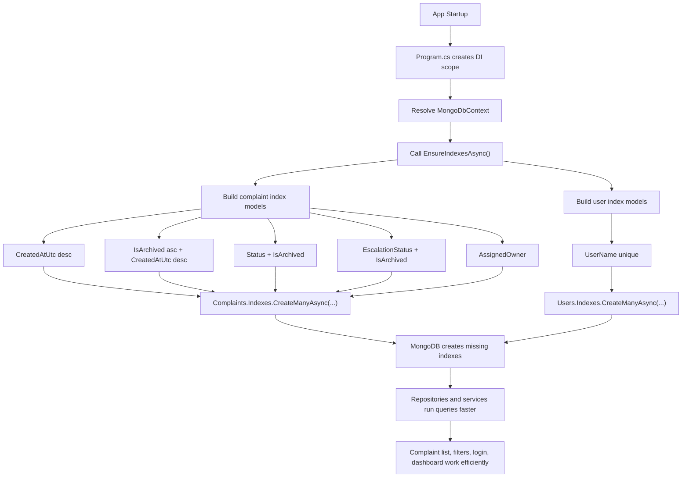

```mermaid
flowchart TD
    A["App Startup"] --> B["Program.cs creates DI scope"]
    B --> C["Resolve MongoDbContext"]
    C --> D["Call EnsureIndexesAsync()"]

    D --> E["Build complaint index models"]
    D --> F["Build user index models"]

    E --> E1["CreatedAtUtc desc"]
    E --> E2["IsArchived asc + CreatedAtUtc desc"]
    E --> E3["Status + IsArchived"]
    E --> E4["EscalationStatus + IsArchived"]
    E --> E5["AssignedOwner"]

    F --> F1["UserName unique"]

    E1 --> G["Complaints.Indexes.CreateManyAsync(...)"]
    E2 --> G
    E3 --> G
    E4 --> G
    E5 --> G

    F1 --> H["Users.Indexes.CreateManyAsync(...)"]

    G --> I["MongoDB creates missing indexes"]
    H --> I

    I --> J["Repositories and services run queries faster"]
    J --> K["Complaint list, filters, login, dashboard work efficiently"]

```