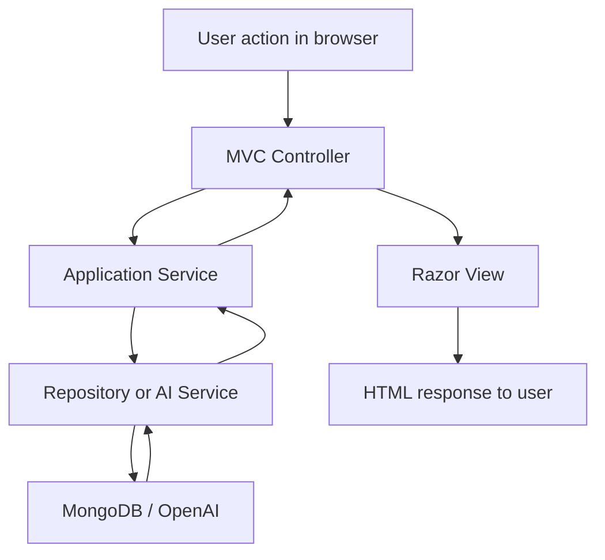

# Presentation Guide

This document is a presentation-ready reference for the **AI-Based Complaint and Sentiment Analysis System** project. It is written so it can be used as:

- a speaking guide during the live demo
- a backup script if you need to explain the project in detail
- a technical reference if the audience asks implementation questions

---

## 1. Project Title

**AI-Based Complaint and Sentiment Analysis System**

---

## 2. One-Line Summary

This project is an **ASP.NET Core MVC complaint management system** that uses **MongoDB** for persistence and **AI-based sentiment analysis** to classify complaint tone, urgency, category, and recommended action items.

---

## 3. Problem Statement

Organizations often receive large volumes of complaints through different channels. Without a structured system:

- complaints are hard to track
- urgent cases may be missed
- teams may respond slowly
- management has limited visibility into complaint trends

This project solves that problem by combining:

- complaint submission and tracking
- role-based workflow management
- AI-assisted sentiment and urgency classification
- escalation logic
- dashboard analytics

---

## 4. Main Objectives

The system was designed to achieve these goals:

1. Allow users to create and manage complaints in a structured workflow.
2. Use AI to analyze complaint text and classify:
   - sentiment
   - category
   - urgency
   - confidence
   - suggested action items
3. Provide role-based access control for different operational users.
4. Support escalation and assignment workflows.
5. Give organizations a dashboard for complaint monitoring and analytics.

---

## 5. Technology Stack

### Backend

- **ASP.NET Core MVC**
- **C#**
- **Razor Views**
- **Dependency Injection**
- **Async/await**

### Database

- **MongoDB**
- **MongoDB.Driver**

### AI

- **OpenAI Responses API**
- fallback **mock AI analyzer** when OpenAI is disabled or unavailable

### Testing

- **xUnit**
- **Moq**
- **Microsoft.AspNetCore.Mvc.Testing**

### UI

- **Tailwind-style utility classes**
- server-rendered Razor pages

---

## 6. Architecture Overview

The project follows a layered architecture with clean separation of concerns.

### Project Structure

```text
IssueSense/
├── IssueSense.Web/
├── IssueSense.Application/
├── IssueSense.Domain/
├── IssueSense.Infrastructure/
├── IssueSense.Tests/
└── docs/
```

### Layer Responsibilities

#### `IssueSense.Web`

Contains:

- MVC controllers
- Razor views
- UI models
- startup configuration
- authentication setup

#### `IssueSense.Application`

Contains:

- DTOs
- service interfaces
- business logic
- complaint orchestration logic
- user authentication rules

#### `IssueSense.Domain`

Contains:

- core entities
- enums
- shared role names

#### `IssueSense.Infrastructure`

Contains:

- MongoDB context
- repository implementations
- MongoDB document mapping
- AI integration implementation

#### `IssueSense.Tests`

Contains:

- unit tests
- MVC integration tests

---

## 7. MVC Request Flow

Use this to explain how a request travels through the system.



### Explanation

- **Controllers** only handle HTTP requests and return views or redirects.
- **Services** contain business logic.
- **Repositories** handle database operations.
- **MongoDB** stores complaint and user data.
- **OpenAI** is used to analyze complaint text.

---

## 8. Why This Architecture Is Good

This architecture improves:

- maintainability
- readability
- testability
- scalability

It also makes the system easier to explain because each layer has a clear responsibility.

For example:

- if the UI changes, we mostly update the Web layer
- if business rules change, we update the Application layer
- if the database technology changes, the Infrastructure layer is the main impact area

---

## 9. Core Features Implemented

### 9.1 User Authentication

The app supports:

- login
- logout
- cookie-based authentication
- role-based authorization

Relevant files:

- [AuthController.cs](/Users/chason/Documents/GitHub/IssueSense/IssueSense.Web/Controllers/AuthController.cs)
- [Program.cs](/Users/chason/Documents/GitHub/IssueSense/IssueSense.Web/Program.cs)
- [Login.cshtml](/Users/chason/Documents/GitHub/IssueSense/IssueSense.Web/Views/Account/Login.cshtml)

### 9.2 Role-Based Access Control

The roles are:

- `support_admin`
- `analyst`
- `triage_officer`
- `case_manager`
- `ai_reviewer`

This is implemented through:

- role constants in [RoleNames.cs](/Users/chason/Documents/GitHub/IssueSense/IssueSense.Domain/Common/RoleNames.cs)
- `[Authorize]` in controllers
- role-aware UI visibility in Razor views

### 9.3 Complaint Management

The system supports:

- create complaint
- list complaints
- view complaint details
- update status
- assign owner
- add comments
- archive complaints

### 9.4 AI Sentiment Analysis

The AI analysis returns:

- sentiment
- category
- urgency
- confidence
- action required flag
- suggested action items with `@owner`

### 9.5 Priority Escalation

The system escalates a complaint when:

- urgency is high
- sentiment is negative
- open complaint age exceeds threshold

### 9.6 Analytics Dashboard

The dashboard shows:

- total complaints
- open complaints
- resolved complaints
- escalated complaints
- sentiment breakdown
- urgency breakdown
- category breakdown
- recent complaints

---

## 10. Complaint Data Model

The complaint entity contains:

- customer information
- complaint details
- AI classification
- escalation status
- assignment
- comments
- archive state

Relevant file:

- [Complaint.cs](/Users/chason/Documents/GitHub/IssueSense/IssueSense.Domain/Entities/Complaint.cs)

Important fields:

- `Title`
- `Description`
- `CustomerName`
- `CustomerEmail`
- `Status`
- `Sentiment`
- `Category`
- `Urgency`
- `Confidence`
- `RequiresAction`
- `SuggestedActions`
- `AssignedOwner`
- `EscalationStatus`
- `EscalationReason`
- `Comments`
- `IsArchived`

---

## 11. User Data Model

The user entity now includes security and monitoring fields:

- `UserName`
- `PasswordHash`
- `Role`
- `DisplayName`
- `IsActive`
- `CreatedAtUtc`
- `LastLoginAtUtc`
- `FailedLoginCount`
- `LockoutEndUtc`

Relevant file:

- [UserAccount.cs](/Users/chason/Documents/GitHub/IssueSense/IssueSense.Domain/Entities/UserAccount.cs)

This supports:

- account status management
- tracking login activity
- lockout after repeated failed login attempts

---

## 12. MongoDB Design

### Collections

The app uses:

- `users`
- `complaints`

### MongoDB Context

Relevant file:

- [MongoDbContext.cs](/Users/chason/Documents/GitHub/IssueSense/IssueSense.Infrastructure/Contexts/MongoDbContext.cs)

This class:

- creates the MongoDB client
- connects to the configured database
- exposes collections
- creates indexes at startup

---

## 13. MongoDB Indexing

A good presentation point is that this app does not only use MongoDB for storage, it also uses **production-style indexing**.

### Why indexes matter

Indexes improve:

- login lookup by username
- complaint list filtering
- status-based filtering
- escalation-based filtering
- sorting by newest complaints

### Example index creation

```csharp
new CreateIndexModel<ComplaintDocument>(
    Builders<ComplaintDocument>.IndexKeys
        .Ascending(x => x.IsArchived)
        .Descending(x => x.CreatedAtUtc))
```

### What it means

This creates a compound index on:

1. `IsArchived`
2. `CreatedAtUtc` descending

This is useful because the complaint list often shows:

- only active complaints
- newest complaints first

### Unique index for usernames

```csharp
new CreateIndexModel<UserDocument>(
    Builders<UserDocument>.IndexKeys.Ascending(x => x.UserName),
    new CreateIndexOptions { Unique = true })
```

This helps:

- fast login lookups
- prevention of duplicate usernames

---

## 14. Production Query Improvement

Originally, complaint filtering was done in memory in the service layer. That works for small datasets, but it is not ideal in production.

Now the system uses MongoDB query filtering in the repository so indexes can be used directly.

Relevant file:

- [ComplaintRepository.cs](/Users/chason/Documents/GitHub/IssueSense/IssueSense.Infrastructure/Repositories/ComplaintRepository.cs)

### Repository filtering example

```csharp
public async Task<IReadOnlyCollection<Complaint>> GetAllAsync(ComplaintQueryDto query, CancellationToken cancellationToken = default)
{
    var filter = BuildFilter(query);
    var sort = BuildSort(query);

    var documents = await context.Complaints
        .Find(filter)
        .Sort(sort)
        .ToListAsync(cancellationToken);

    return documents.Select(MapComplaint).ToArray();
}
```

### Why this matters

This is more production-like because:

- filtering happens in MongoDB
- fewer documents are loaded into memory
- indexes are actually used
- performance scales better

---

## 15. AI Integration

The AI service is implemented in:

- [AIAnalysisService.cs](/Users/chason/Documents/GitHub/IssueSense/IssueSense.Infrastructure/Services/AIAnalysisService.cs)

The app supports two modes:

1. **OpenAI mode**
2. **Mock fallback mode**

### AI output fields

The AI returns:

- `sentiment`
- `category`
- `urgency`
- `confidence`
- `requiresAction`
- `suggestedActions`

### Example OpenAI prompt payload structure

```csharp
var payload = new
{
    model = settings.Model,
    instructions = "You are an AI complaint classifier. Classify complaint text and return only structured JSON matching the schema.",
    input = $"Analyze this complaint description: {complaintText}"
};
```

### Example structured result

```csharp
new SentimentAnalysisResultDto
{
    Sentiment = SentimentType.Negative,
    Category = "Billing",
    Urgency = UrgencyLevel.High,
    Confidence = 0.91,
    RequiresAction = true
}
```

### AI logging

The service now logs:

- whether OpenAI or mock analysis was used
- the raw OpenAI response
- fallback behavior
- deserialization issues

This is useful in production monitoring and demo troubleshooting.

---

## 16. Manual Re-Analyze Feature

The system includes a **manual Re-analyze button** on the complaint detail page.

This allows authorized roles to re-run AI analysis after:

- a complaint is edited
- the team wants a refreshed interpretation
- the OpenAI configuration changes

Roles allowed:

- `support_admin`
- `case_manager`
- `ai_reviewer`

This is a strong demo feature because it shows the AI integration is operational, not just one-time at complaint creation.

---

## 17. Suggested Actions with Owners

The AI can also recommend action items, for example:

- `@case_manager`
- `@triage_officer`
- `@support_admin`

Example output:

```json
{
  "requiresAction": true,
  "suggestedActions": [
    {
      "owner": "@case_manager",
      "action": "Validate billing records and prepare a customer update or refund decision."
    }
  ]
}
```

This makes the project more realistic because the AI does not only classify complaints, it also helps guide operations.

---

## 18. Security Features

This is an important section for presentation.

### Implemented Security Features

- cookie-based authentication
- role-based authorization
- password hashing with PBKDF2
- anti-forgery tokens on sensitive forms
- input validation
- login rate limiting
- login lockout
- secure cookie settings

### Password Hashing

Relevant file:

- [PasswordSecurity.cs](/Users/chason/Documents/GitHub/IssueSense/IssueSense.Application/Security/PasswordSecurity.cs)

Example:

```csharp
var hash = Rfc2898DeriveBytes.Pbkdf2(
    password,
    salt,
    IterationCount,
    HashAlgorithmName.SHA256,
    KeySize);
```

### Lockout Logic

The app now locks a user for 15 minutes after 5 failed login attempts.

This state is stored in MongoDB.

### Rate Limiting

The login endpoint is rate-limited by IP using ASP.NET Core rate limiting middleware.

This protects the app from repeated brute-force attempts.

### Secure Cookie Configuration

Relevant file:

- [Program.cs](/Users/chason/Documents/GitHub/IssueSense/IssueSense.Web/Program.cs)

Key settings:

- `HttpOnly`
- `SameSite=Lax`
- `SecurePolicy=Always`
- sliding expiration

---

## 19. Role-Based Workflow

The app uses five roles.

### `support_admin`

- full operational access
- can create complaints
- can assign
- can update status
- can archive
- can re-analyze

### `analyst`

- read-only access
- can view dashboard and complaints
- cannot modify workflow

### `triage_officer`

- handles intake
- can create complaints
- can assign
- can comment
- can only move `New -> InProgress`

### `case_manager`

- handles ongoing complaint lifecycle
- can update status through resolution
- can assign
- can comment
- can re-analyze

### `ai_reviewer`

- reviews AI outputs
- can comment
- can re-analyze
- cannot change workflow status

---

## 20. Complaint Lifecycle

This is a good flow to explain during the demo.

1. Complaint is created.
2. AI analyzes the description.
3. The system sets:
   - sentiment
   - urgency
   - category
   - confidence
   - suggested action items
4. Escalation rules run.
5. Complaint is assigned to an owner.
6. Team members comment and update status.
7. Complaint is resolved or archived.

---

## 21. Escalation Logic

The system escalates complaints automatically based on business rules.

Example logic:

- high urgency complaint
- negative sentiment
- old open complaint

Example implementation idea:

```csharp
if (complaint.Urgency == UrgencyLevel.High)
{
    reasons.Add("High urgency complaint");
}

if (complaint.Sentiment == SentimentType.Negative)
{
    reasons.Add("Negative sentiment detected");
}
```

This is useful in presentation because it shows that the app is not simple CRUD. It includes business rules.

---

## 22. Archive Instead of Hard Delete

This is another strong design decision to mention.

Instead of hard-deleting complaints through the UI, the app uses **archive/soft-delete** behavior.

Why this is better:

- safer for auditability
- better for traceability
- better for compliance-oriented systems

This is production-appropriate because business complaints are often records that should not be permanently deleted by normal users.

---

## 23. Error Handling

The system includes user-friendly feedback:

- invalid login feedback
- validation messages for forms
- complaint workflow error messages
- role restriction feedback
- global exception handling

Examples:

- login with invalid password
- triage user attempts invalid status transition
- posting invalid comment
- viewing a missing complaint

---

## 24. Logging and Monitoring

The app now includes better operational logging.

### Startup logs

It logs:

- environment
- seed settings
- MongoDB database name
- index setup
- seed count before and after

### Authentication logs

It logs:

- login success
- login failure
- lockout conditions
- logout
- rate-limit rejection

### AI logs

It logs:

- whether OpenAI was used
- whether mock fallback was used
- the raw AI JSON response
- deserialization problems

### Health endpoint

The app exposes:

- `/health`

This is useful for deployment checks.

---

## 25. Testing Framework and Testing Types

The project uses:

- **xUnit**
- **Moq**
- **Microsoft.AspNetCore.Mvc.Testing**

### Types of tests

#### Unit tests

These verify service logic, such as:

- complaint creation
- complaint re-analysis
- archive behavior
- user creation
- login lockout

#### Integration tests

These verify MVC behavior, such as:

- login page loading
- anonymous redirect behavior

### Run tests

```bash
dotnet test IssueSense.slnx -p:UseSharedCompilation=false -maxcpucount:1 -nr:false
```

Current result:

- **11 tests passed**
- **0 tests failed**

---

## 26. Deployment Readiness

The app includes production-oriented deployment improvements:

- MongoDB indexes created at startup
- reverse proxy support through forwarded headers
- secure cookies
- Cloud Run Dockerfile
- `.dockerignore`
- production hiding of demo role accounts

### Cloud Run support

Files:

- [Dockerfile](/Users/chason/Documents/GitHub/IssueSense/Dockerfile)
- [.dockerignore](/Users/chason/Documents/GitHub/IssueSense/.dockerignore)

---

## 27. Live Demo Script

This is the most useful section during presentation.

### Opening

Say:

> This project is an ASP.NET Core MVC complaint management system enhanced with AI sentiment analysis. It uses MongoDB for persistence, follows layered architecture, supports multiple operational roles, and includes AI-driven classification, escalation, and analytics.

### Demo Step 1: Login

Show:

- login page
- role-based access

Explain:

- authentication is cookie-based
- demo accounts are hidden automatically in production

### Demo Step 2: Dashboard

Show:

- total complaints
- open complaints
- escalated complaints
- sentiment and urgency analytics

Explain:

- this helps organizations monitor complaint trends at a glance

### Demo Step 3: Complaint List

Show:

- search
- filters
- status badges
- urgency
- escalation
- assignment

Explain:

- list filtering is now executed in MongoDB for better production performance

### Demo Step 4: Create Complaint

Create a complaint with a strong negative description.

Explain:

- complaint is saved
- AI runs automatically
- sentiment, urgency, and category are generated
- escalation may be triggered

### Demo Step 5: Complaint Details

Show:

- AI confidence
- escalation reason
- assigned owner
- suggested action items
- comments

Explain:

- the details page combines operational workflow and AI analysis in one screen

### Demo Step 6: Add Comment

Post a comment and show the comment feed updating.

Explain:

- comments are embedded with the complaint
- internal collaboration is tracked directly in the complaint record

### Demo Step 7: Re-analyze

Trigger manual re-analysis.

Explain:

- useful when review is needed
- AI reviewer or case manager can refresh classification

### Demo Step 8: Role Differences

Use different users if time allows:

- `analyst`: read-only
- `triage_officer`: intake + limited status change
- `case_manager`: full case handling
- `ai_reviewer`: AI audit role
- `support_admin`: full operational access

### Demo Step 9: Archive

Show archive instead of delete.

Explain:

- safer than hard delete
- better for real complaint systems

---

## 28. Common Questions and Suggested Answers

### Q1. Why did you use ASP.NET Core MVC instead of Web API?

Suggested answer:

> The assignment required ASP.NET Core MVC with Razor Views. I used MVC because the app is a server-rendered internal operations tool, so controller and view integration fits well.

### Q2. Why MongoDB instead of SQL?

Suggested answer:

> MongoDB fits well for complaint records because complaint documents include nested comments, AI analysis, suggested actions, and archive metadata. It also simplified the document model for this project.

### Q3. Is the AI real or mocked?

Suggested answer:

> The app supports both. It can call OpenAI through the Responses API, and it also has a local fallback classifier when OpenAI is disabled or unavailable.

### Q4. Is the app secure?

Suggested answer:

> It includes authentication, authorization, PBKDF2 password hashing, anti-forgery tokens, input validation, secure cookie settings, login rate limiting, and lockout.

### Q5. Why archive instead of delete?

Suggested answer:

> In production complaint systems, records often need to remain for audit and reporting purposes. Archive is a safer operational choice than hard delete.

### Q6. What makes this production-ready?

Suggested answer:

> The project now includes indexed MongoDB queries, reverse proxy support, secure auth, lockout, rate limiting, startup logging, health checks, AI logging, and Cloud Run containerization.

---

## 29. Limitations and Honest Improvements

Be honest about what still could be improved.

Remaining improvements include:

- full user management:
  - edit user
  - deactivate user
  - password reset
- broader integration and UI tests
- audit history for all workflow actions
- more advanced text search
- pagination for large datasets
- richer monitoring integration

This is a strong point in a presentation because it shows you understand software engineering tradeoffs.

---

## 30. Useful Commands During Presentation

### Run app

```bash
dotnet run --project IssueSense.Web
```

### Build project

```bash
dotnet build IssueSense.slnx -p:UseSharedCompilation=false -maxcpucount:1 -nr:false
```

### Run tests

```bash
dotnet test IssueSense.slnx -p:UseSharedCompilation=false -maxcpucount:1 -nr:false
```

### Health check

```bash
curl https://YOUR_HOST/health
```

---

## 31. Final Closing Statement

You can end your presentation with something like:

> In summary, this project delivers an AI-enhanced complaint management system built with ASP.NET Core MVC, MongoDB, and OpenAI integration. It supports structured complaint handling, role-based workflows, automated sentiment and urgency analysis, escalation logic, secure authentication, and analytics reporting. I also improved the system with production-oriented features such as indexing, secure login protections, logging, health checks, and deployment readiness.

---

## 32. Related Documents

Additional docs in this project:

- [SYSTEM_ARCHITECTURE.md](/Users/chason/Documents/GitHub/IssueSense/docs/SYSTEM_ARCHITECTURE.md)
- [ROLE_ACCESS_GUIDE.md](/Users/chason/Documents/GitHub/IssueSense/docs/ROLE_ACCESS_GUIDE.md)
- [ROLE_ACCESS_SUMMARY.md](/Users/chason/Documents/GitHub/IssueSense/docs/ROLE_ACCESS_SUMMARY.md)
- [ROLE_ACCESS_PRESENTATION_TABLE.md](/Users/chason/Documents/GitHub/IssueSense/docs/ROLE_ACCESS_PRESENTATION_TABLE.md)
- [ROLE_USE_CASE_FLOWS.md](/Users/chason/Documents/GitHub/IssueSense/docs/ROLE_USE_CASE_FLOWS.md)
- [API_AND_CONFIG_GUIDE.md](/Users/chason/Documents/GitHub/IssueSense/docs/API_AND_CONFIG_GUIDE.md)
- [PRE_PRODUCTION_CHECKLIST.md](/Users/chason/Documents/GitHub/IssueSense/docs/PRE_PRODUCTION_CHECKLIST.md)
- [RUBRIC_EVALUATION.md](/Users/chason/Documents/GitHub/IssueSense/docs/RUBRIC_EVALUATION.md)
- [RUBRIC_GRADING_SHEET.md](/Users/chason/Documents/GitHub/IssueSense/docs/RUBRIC_GRADING_SHEET.md)
