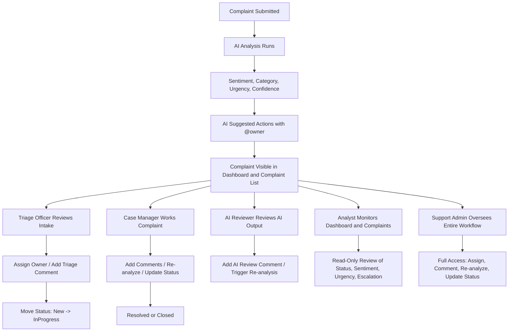
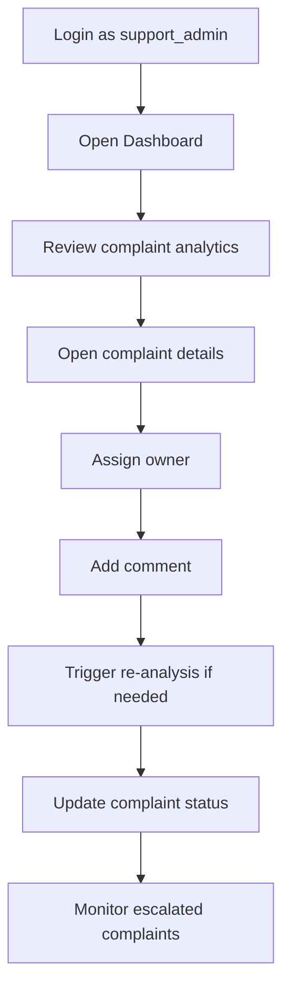
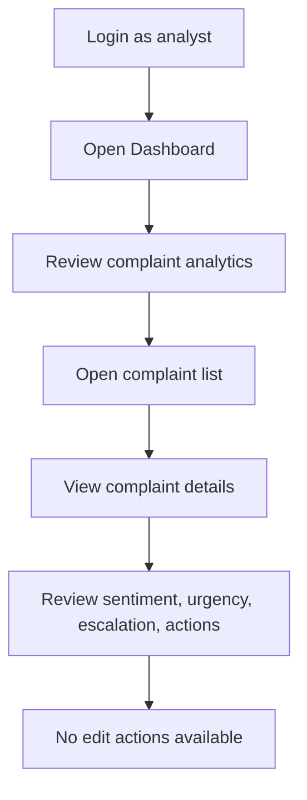
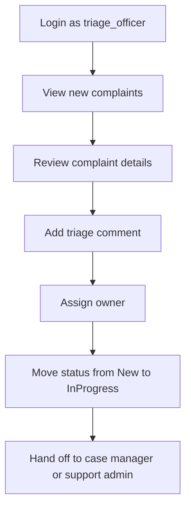
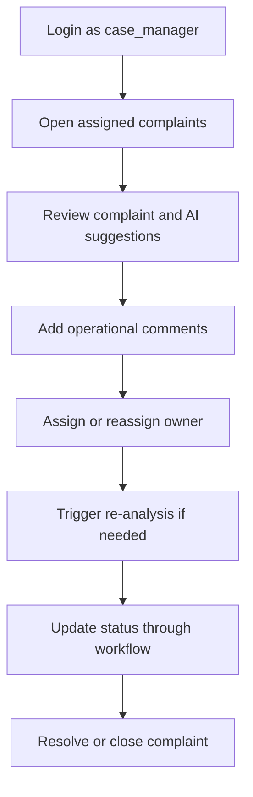
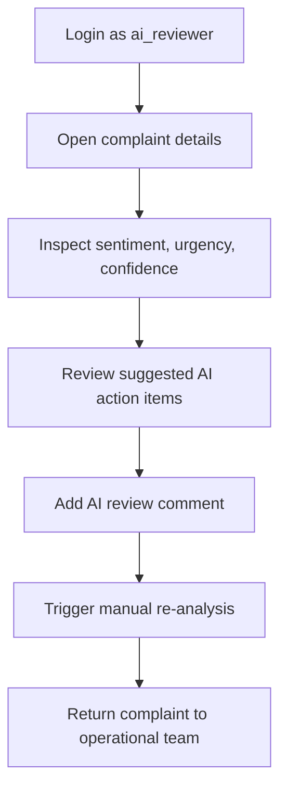

# Role Use-Case Flows

This document shows the main workflow for each role in the AI-Based Complaint and Sentiment Analysis System.

## Overview

The system uses five operational roles:

- `support_admin`
- `analyst`
- `triage_officer`
- `case_manager`
- `ai_reviewer`

## High-Level Role Flow

## Per-Role Flows

### 1. Support Admin

### 2. Analyst

### 3. Triage Officer

### 4. Case Manager

### 5. AI Reviewer

## Practical Demo Sequence

Use this order when demonstrating the system:

1. `analyst`
   Show dashboard and read-only complaint access.

2. `triage_officer`
   Show complaint intake, assignment, comment entry, and limited status movement.

3. `case_manager`
   Show complaint lifecycle handling and resolution flow.

4. `ai_reviewer`
   Show AI review comments and manual re-analysis.

5. `support_admin`
   Show full end-to-end operational control.

## Key Message

The workflow is intentionally split by function:

- `analyst` observes
- `triage_officer` routes
- `case_manager` resolves
- `ai_reviewer` validates AI output
- `support_admin` oversees operations
