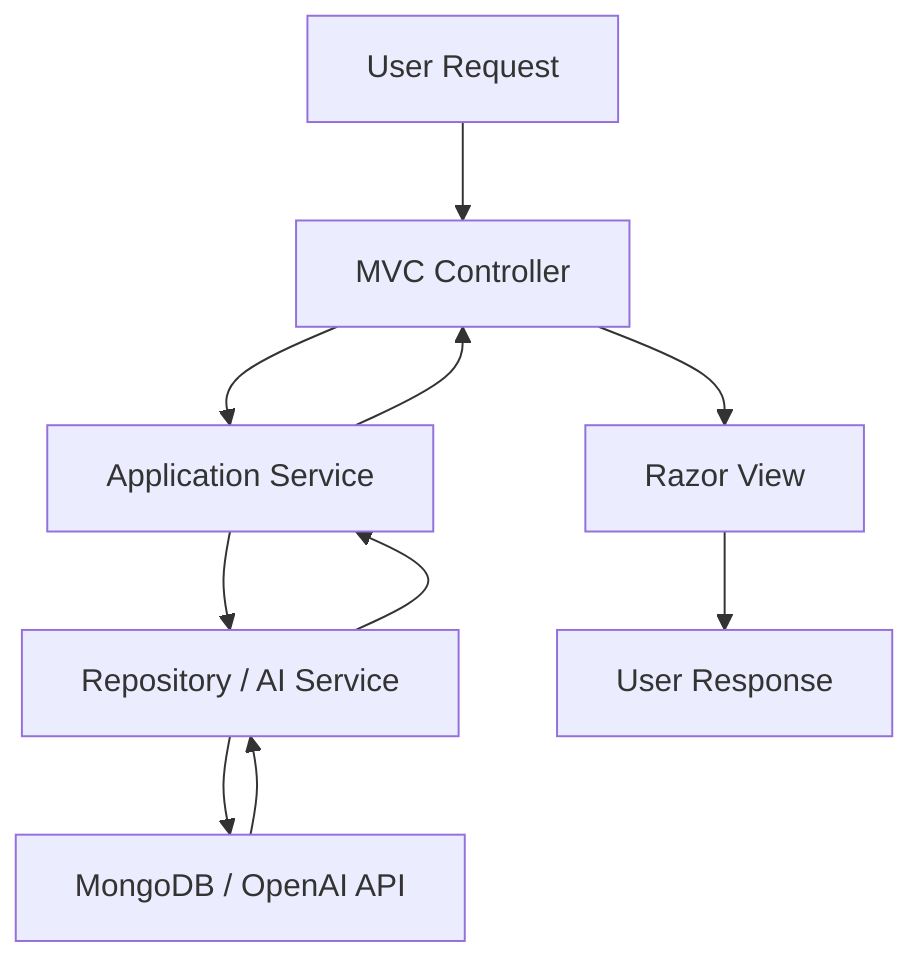
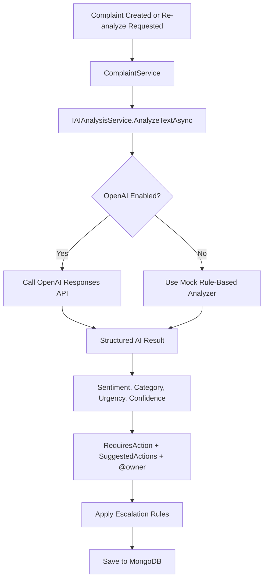

# System Architecture

This document describes the technical architecture of the AI-Based Complaint and Sentiment Analysis System.

## 1. Overview

The application is an ASP.NET Core MVC web system for complaint management enhanced with AI-based sentiment and urgency analysis.

Main capabilities:

- complaint submission and tracking
- sentiment/category/urgency/confidence analysis
- AI-suggested action items with `@owner`
- complaint assignment workflow
- role-based access control
- escalation rules
- analytics dashboard

## 2. Architecture Style

The solution follows a layered design with separation of concerns:

- **Web layer**: MVC controllers, Razor views, UI models
- **Application layer**: DTOs, service interfaces, business rules
- **Domain layer**: core entities, enums, role names
- **Infrastructure layer**: MongoDB persistence, repository implementations, AI integration

## 3. Solution Structure

```text
IssueSense/
├── IssueSense.Web/
├── IssueSense.Application/
├── IssueSense.Domain/
├── IssueSense.Infrastructure/
├── IssueSense.Tests/
└── docs/
```

### `IssueSense.Web`

Responsible for:

- MVC controllers
- Razor views
- startup configuration
- authentication cookie setup
- user-facing view models

Key areas:

- `Controllers/`
- `Views/`
- `Models/`
- `Program.cs`

### `IssueSense.Application`

Responsible for:

- DTO definitions
- service interfaces
- business logic
- orchestration between repositories and AI service

Key areas:

- `DTOs/`
- `Interfaces/Services/`
- `Interfaces/Repositories/`
- `Services/`

### `IssueSense.Domain`

Responsible for:

- complaint entity definitions
- enums
- role constants
- business-oriented core objects

Key areas:

- `Entities/`
- `Enums/`
- `Common/`

### `IssueSense.Infrastructure`

Responsible for:

- MongoDB access
- repository implementations
- document mapping
- OpenAI integration
- persistence details

Key areas:

- `Contexts/`
- `Documents/`
- `Repositories/`
- `Services/`
- `Configuration/`

### `IssueSense.Tests`

Responsible for:

- unit tests for service-layer business logic
- MVC integration tests with `WebApplicationFactory`
- protecting key complaint workflows from regression

## 4. MVC Application Flow



### Controller Responsibility

Controllers only:

- receive HTTP requests
- validate model state
- call services
- return views or redirects

Controllers do not contain business logic.

### Service Responsibility

Services:

- implement business rules
- trigger AI analysis
- apply escalation logic
- manage complaint assignments
- prepare dashboard analytics

### Repository Responsibility

Repositories:

- talk to MongoDB
- map entities to MongoDB documents
- perform CRUD operations

## 5. MongoDB Design

The application uses MongoDB as the data store.

Configured in:

- [appsettings.json](/Users/chason/Documents/GitHub/IssueSense/IssueSense.Web/appsettings.json)

Main configuration section:

```json
"MongoDb": {
  "ConnectionString": "mongodb://localhost:27017",
  "DatabaseName": "IssueSenseDb",
  "ComplaintsCollectionName": "complaints",
  "UsersCollectionName": "users"
}
```

### MongoDB Context

MongoDB access is handled by:

- [MongoDbContext.cs](/Users/chason/Documents/GitHub/IssueSense/IssueSense.Infrastructure/Contexts/MongoDbContext.cs)

It exposes collection access for:

- `Users`
- `Complaints`

### Collections

#### `users`

Stores:

- username
- password hash
- role
- display name

#### `complaints`

Stores:

- complaint details
- AI analysis result
- escalation state
- assignment state
- comments
- suggested action items

## 6. Complaint Data Model

Key complaint fields include:

- `Title`
- `Description`
- `CustomerName`
- `CustomerEmail`
- `Status`
- `Category`
- `Sentiment`
- `Urgency`
- `Confidence`
- `RequiresAction`
- `SuggestedActions`
- `AssignedOwner`
- `EscalationStatus`
- `EscalationReason`
- `Comments`

Core entity:

- [Complaint.cs](/Users/chason/Documents/GitHub/IssueSense/IssueSense.Domain/Entities/Complaint.cs)

MongoDB document:

- [ComplaintDocument.cs](/Users/chason/Documents/GitHub/IssueSense/IssueSense.Infrastructure/Documents/ComplaintDocument.cs)

## 7. Repositories

Repositories are used through interfaces in the application layer and implemented in infrastructure.

### User Repository

Interface:

- [IUserRepository.cs](/Users/chason/Documents/GitHub/IssueSense/IssueSense.Application/Interfaces/Repositories/IUserRepository.cs)

Implementation:

- [UserRepository.cs](/Users/chason/Documents/GitHub/IssueSense/IssueSense.Infrastructure/Repositories/UserRepository.cs)

Responsibilities:

- get users
- insert/update/delete users
- fetch by username
- seed default users

### Complaint Repository

Interface:

- [IComplaintRepository.cs](/Users/chason/Documents/GitHub/IssueSense/IssueSense.Application/Interfaces/Repositories/IComplaintRepository.cs)

Implementation:

- [ComplaintRepository.cs](/Users/chason/Documents/GitHub/IssueSense/IssueSense.Infrastructure/Repositories/ComplaintRepository.cs)

Responsibilities:

- CRUD operations
- update complaint status
- add comments
- persist AI results
- persist assignment information

## 8. Services

### `UserService`

File:

- [UserService.cs](/Users/chason/Documents/GitHub/IssueSense/IssueSense.Application/Services/UserService.cs)

Responsibilities:

- login validation
- role checks
- seed default users

### `ComplaintService`

File:

- [ComplaintService.cs](/Users/chason/Documents/GitHub/IssueSense/IssueSense.Application/Services/ComplaintService.cs)

Responsibilities:

- create complaints
- fetch complaint lists and details
- update status
- add comments
- update assignment
- trigger manual re-analysis
- apply escalation logic
- build dashboard analytics
- seed sample complaints

### `AIAnalysisService`

File:

- [AIAnalysisService.cs](/Users/chason/Documents/GitHub/IssueSense/IssueSense.Infrastructure/Services/AIAnalysisService.cs)

Responsibilities:

- analyze complaint text
- call OpenAI Responses API when enabled
- fall back to mock classification when disabled or unavailable
- return structured result

## 9. AI Integration Flow



### AI Configuration

OpenAI settings:

- `OpenAI__Enabled`
- `OpenAI__ApiKey`
- `OpenAI__Model`
- `OpenAI__Endpoint`
- `OpenAI__UseMockFallback`

Default model:

- `gpt-5.4-nano`

### AI Output

The AI returns:

- `sentiment`
- `category`
- `urgency`
- `confidence`
- `requiresAction`
- `suggestedActions`

Each suggested action contains:

- `owner`
- `action`

## 10. Role-Based Access Control

The application uses five roles:

- `support_admin`
- `analyst`
- `triage_officer`
- `case_manager`
- `ai_reviewer`

Role constants:

- [RoleNames.cs](/Users/chason/Documents/GitHub/IssueSense/IssueSense.Domain/Common/RoleNames.cs)

Controllers use `[Authorize]` and role-based checks to control:

- complaint creation
- status updates
- assignment updates
- comments
- re-analysis

See also:

- [ROLE_ACCESS_GUIDE.md](/Users/chason/Documents/GitHub/IssueSense/docs/ROLE_ACCESS_GUIDE.md)

## 11. Dashboard Analytics

The dashboard provides organizational visibility into complaint operations.

Current analytics include:

- total complaints
- open complaints
- resolved / closed complaints
- high urgency complaints
- negative sentiment complaints
- escalated complaints
- sentiment distribution
- urgency distribution
- status breakdown
- category breakdown

Dashboard view:

- [Dashboard/Index.cshtml](/Users/chason/Documents/GitHub/IssueSense/IssueSense.Web/Views/Dashboard/Index.cshtml)

## 12. Seeding Strategy

At startup, the application seeds:

- default users
- about 100 sample complaints

This is done in:

- [Program.cs](/Users/chason/Documents/GitHub/IssueSense/IssueSense.Web/Program.cs)

The complaint seed includes:

- varied titles
- varied complaint descriptions
- different customers
- mixed statuses
- AI analysis results
- comments
- assignments when suggested

## 13. Dependency Injection

Configured in:

- [Program.cs](/Users/chason/Documents/GitHub/IssueSense/IssueSense.Web/Program.cs)

Registered components:

- `MongoDbContext`
- repositories
- services
- `HttpClient` for AI service

## 14. Security Notes

- cookie-based authentication is used
- password storage is hashed in the current implementation
- no `super_admin` role exists
- controllers use role restrictions for write operations
- analysts remain read-only

## 15. Future Enhancements

Possible next improvements:

- pagination
- audit trail / history log
- exportable reports
- complaint assignment history
- SLA tracking
- notification workflow
- background jobs for follow-up reminders
- AI prompt/version tracking

## 16. Summary

The application is built as a clean ASP.NET Core MVC architecture with:

- thin controllers
- service-based business logic
- repository-based persistence
- MongoDB document storage
- OpenAI-backed AI classification with fallback logic
- operational RBAC
- assignment, escalation, analytics, and AI review workflows
